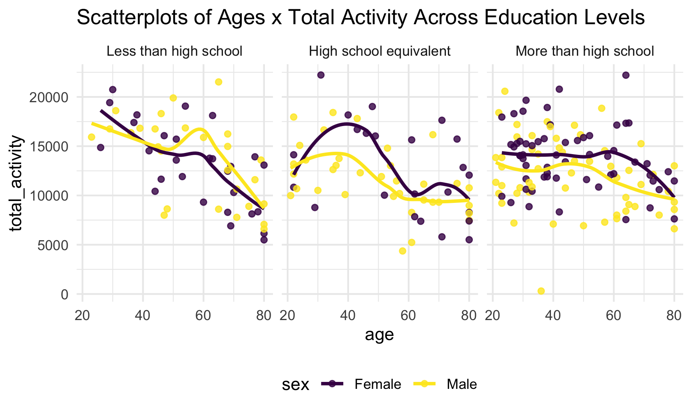

p8105_hw3_rs4338
================
Rebecca Shyu
2024-10-08

## Problem 0:

- Create a public GitHub repo + local R Project: p8105_hw3_rs4338
- Create a single .Rmd file named p8105_hw3_rs4338.Rmd that renders to
  github_document
- Create a subdirectory (data) to store the local data files, and use
  relative paths to access these data files
- Submit a link to your repo via Courseworks:
  <https://github.com/rysgpd/p8105_hw3_rs4338>

``` r
nhanes_demo = read_csv("data/nhanes/nhanes_covar.csv", 
                       skip = 4) %>% 
  janitor::clean_names() %>% 
  drop_na() %>% 
  filter(
    age >= 21
  ) %>% 
  mutate(
    sex = ifelse(sex == 1, "Male", "Female"),
    education = 
      case_match(
        education,
        1 ~ "Less than high school",
        2 ~ "High school equivalent",
        3 ~ "More than high school"
      ),
    education = factor(education, levels = c("Less than high school", "High school equivalent", "More than high school"))
  ) 

nhanes_acc_data = read_csv("data/nhanes/nhanes_accel.csv", show_col_types = FALSE) %>%
  janitor::clean_names() %>% 
  distinct() %>% 
  pivot_longer(
    cols = min1:min1440,
    names_to = "minute",
    values_to = "mims_data"
  )
  

# join the demographic and accelerometer datasets
nhanes = inner_join(nhanes_demo, nhanes_acc_data, by="seqn")
# there are 22 patients who don't have any demographic data
```

Reader friendly table for the number of men and women in each education
category, and create a visualization of the age distributions for men
and women in each education category.

- I decided to use a density plot to visualize the age distributions for
  men and women in each education category because the histogram was not
  easily interpretable and rigid. I overlapped the density plots for men
  and women to easily compare them.
- It appears that the distributions across all educational levels for
  men are bi-modal while women are unimodal.
- For the less than high school education level, it leaned to more older
  populations for both men and women.
- For the high school equivalent education level, it looked like a
  steady incline for women and it peaked around age 70. For men, it was
  pretty consistent throughout and then declined after age 60.
- For the more than high school education level, women had up to 0.025
  density around age 30, which shows more education among younger women.
  Similarly, but not as high in comparison to women, younger men were
  higher than older men.

``` r
nhanes %>% 
  group_by(seqn) %>% 
  slice(1) %>% 
  group_by(education, sex) %>% 
  count() %>% 
  arrange(education) %>% 
  knitr::kable() %>% 
  collapse_rows(columns = 1)
```

<table>
<thead>
<tr>
<th style="text-align:left;">
education
</th>
<th style="text-align:left;">
sex
</th>
<th style="text-align:right;">
n
</th>
</tr>
</thead>
<tbody>
<tr>
<td style="text-align:left;vertical-align: middle !important;" rowspan="2">
Less than high school
</td>
<td style="text-align:left;">
Female
</td>
<td style="text-align:right;">
28
</td>
</tr>
<tr>
<td style="text-align:left;">
Male
</td>
<td style="text-align:right;">
27
</td>
</tr>
<tr>
<td style="text-align:left;vertical-align: middle !important;" rowspan="2">
High school equivalent
</td>
<td style="text-align:left;">
Female
</td>
<td style="text-align:right;">
23
</td>
</tr>
<tr>
<td style="text-align:left;">
Male
</td>
<td style="text-align:right;">
35
</td>
</tr>
<tr>
<td style="text-align:left;vertical-align: middle !important;" rowspan="2">
More than high school
</td>
<td style="text-align:left;">
Female
</td>
<td style="text-align:right;">
59
</td>
</tr>
<tr>
<td style="text-align:left;">
Male
</td>
<td style="text-align:right;">
56
</td>
</tr>
</tbody>
</table>

``` r
nhanes %>% 
  group_by(seqn) %>% 
  slice(1) %>% 
  group_by(education, sex) %>% 
  ggplot(aes(x = age, fill = sex)) +
  geom_density(alpha = .3) +
  facet_grid(. ~ education) +
  labs(
    title = "Density Plots of Ages Across Genders & Education Levels" 
    )
```


Comments about the Total Activity Across Ages, comparing men and women
and for each education level:

- For all education levels and both sexes, there is a generally downward
  trend of total activity (minutes) measured. There are a few exceptions
  that have slight peaks around ages 60 (less than high school for both,
  more than high school for men) or 70 (high school equivalent).
- For high school equivalent and more than high school, women are almost
  always higher than men. For less than high school, younger women have
  higher activity until age 40, then the men have higher total activity.
- The trend lines start at the highest for less than high school, but
  ends at the lowest also for the less than high school level. More than
  high school seems to have less variability in general, but has the
  most extreme outliers.

``` r
nhanes = 
  nhanes %>% 
  mutate(
    total_activity = rowSums(across(min1:min1440))
  ) %>% 
  relocate(total_activity, .after = education)

nhanes %>% 
  ggplot(aes(x = age, y = total_activity, color = sex)) +
  geom_point(alpha = .8) +
  geom_smooth(se = FALSE) +
  facet_grid(. ~ education) +
  labs(
    title = "Scatterplots of Ages x Total Activity Across Education Levels" 
    )
```

``` r
nhanes2 = 
  nhanes %>% 
  group_by(seqn) %>% 
  mutate(
    total_activity = sum(mims_data)
  )

nhanes2 %>% 
  group_by(seqn) %>% 
  slice(1) %>% 
  ggplot(aes(x = age, y = total_activity, color = sex)) +
  geom_point(alpha = .8) +
  geom_smooth(se = FALSE) +
  facet_grid(. ~ education) +
  labs(
    title = "Scatterplots of Ages x Total Activity Across Education Levels" 
    )
```



Accelerometer Data Over 24 Hours for each education level and across
sexes.

``` r
nhanes %>% 
  ggplot(aes(x = age, y = total_activity, color = sex)) +
  geom_point(alpha = .8) +
  geom_smooth(se = FALSE) +
  facet_grid(. ~ education) +
  labs(
    title = "Scatterplots of Ages x Total Activity Across Education Levels" 
    )
```
