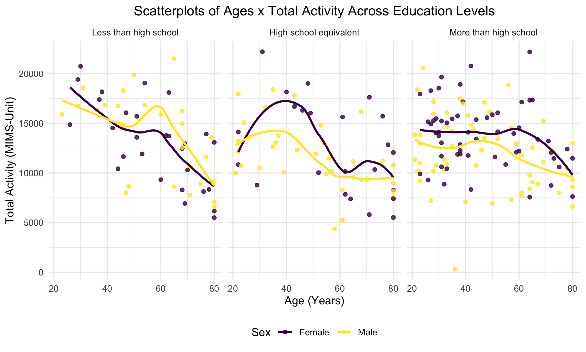

p8105_hw3_rs4338
================
Rebecca Shyu
2024-10-08

## Problem 0:

- Create a public GitHub repo + local R Project: p8105_hw3_rs4338
- Create a single .Rmd file named p8105_hw3_rs4338.Rmd that renders to
  github_document
- Create a subdirectory (data) to store the local data files, and use
  relative paths to access these data files
- Submit a link to your repo via Courseworks:
  <https://github.com/rysgpd/p8105_hw3_rs4338>

## Problem 1:

- This dataset has 7 columns, including variables of date, precipitation
  (tenths of mm), snowfall (mm), snow depth (mm), minimum temperature
  (tenths of degrees in Celsius), and maximum temperature (tenths of
  degrees in Celsius) and 2595176 rows of data. There are 747 unique
  ids.
- Looking at the summary, snowfall and snow depth have a lot of zeros
  and NAs; specifically there are 2008508 zeros and 381221 NAs. The
  zeros make sense because it doesn’t snow most months, while rain
  doesn’t have as many zeros because it can rain at any season.

``` r
data("ny_noaa")

summary(ny_noaa)
```

    ##       id                 date                 prcp               snow       
    ##  Length:2595176     Min.   :1981-01-01   Min.   :    0.00   Min.   :  -13   
    ##  Class :character   1st Qu.:1988-11-29   1st Qu.:    0.00   1st Qu.:    0   
    ##  Mode  :character   Median :1997-01-21   Median :    0.00   Median :    0   
    ##                     Mean   :1997-01-01   Mean   :   29.82   Mean   :    5   
    ##                     3rd Qu.:2005-09-01   3rd Qu.:   23.00   3rd Qu.:    0   
    ##                     Max.   :2010-12-31   Max.   :22860.00   Max.   :10160   
    ##                                          NA's   :145838     NA's   :381221  
    ##       snwd            tmax               tmin          
    ##  Min.   :   0.0   Length:2595176     Length:2595176    
    ##  1st Qu.:   0.0   Class :character   Class :character  
    ##  Median :   0.0   Mode  :character   Mode  :character  
    ##  Mean   :  37.3                                        
    ##  3rd Qu.:   0.0                                        
    ##  Max.   :9195.0                                        
    ##  NA's   :591786

``` r
ny_noaa =
  ny_noaa %>% 
  mutate(
    tmin = as.numeric(tmin),
    tmax = as.numeric(tmax)
  ) %>%
  relocate(tmin, .before=tmax) %>% 
  separate(date, c("year", "month", "date"), convert=TRUE)
```

### Average Max Temp in Jan/July

- This plot is a kind of a mess. There are over 700 IDs so putting them
  all on a plot like this doesn’t really give an interpretable structure
  other than they are all kind of similiar in terms of ups and downs.
- January is lower than July which makes sense. There is an outlier in
  July in the late 1980s where it’s colder than the rest. There’s
  another outlier in the early 1980s in January where it’s also colder
  than the rest. Otherwise, not many crazy outliers.

``` r
ny_noaa %>% 
  drop_na(tmax) %>% 
  filter(
    month == 1 | month == 7
  ) %>% 
  group_by(id, year, month) %>%
  summarise(mean_tmax = mean(tmax, na.rm=TRUE)) %>% 
  ggplot(aes(x = year, y=mean_tmax, group = id)) +
  geom_point() + geom_line()+
  facet_grid(~month)
```


### TMin vs TMax & Distribution of Snowfall

- Based on the hex plot, it’s clustered in the middle but there is
  variability on all aspects. Typically, it looks like as min goes up,
  max also goes up, but I’m confused at the outlier on the bottom (ex:
  -250 min and -400 max) which doesn’t make sense.
- The density plot shows that the general pattern is very similar to
  each year, but the peaks are getting lower over time. There are many
  peaks (multimodal).

``` r
plot1 = 
  ny_noaa %>% 
  ggplot(aes(x=tmin, y=tmax)) +
  geom_hex()+
  labs(
    title = "Min Temp vs Max Temp ",
    x = "Tenths of Degrees in C",
    y = "Tenths of Degrees in C"
    ) +
  theme(plot.title = element_text(hjust = 0.5))

plot2 = 
  ny_noaa %>% 
  filter (
    snow > 0,
    snow < 100
    ) %>%
  group_by(year) %>% 
  ggplot(aes(x=snow, fill = as.factor(year))) +
  geom_density(alpha = 0.4)+
  labs(
    title = "Distribution of Snowfall 0-100 mm",
    x = "Years",
    y = "Density"
    ) +
  theme(plot.title = element_text(hjust = 0.5))

plot1 + plot2
```


## Problem 2:

``` r
nhanes_demo = read_csv("data/nhanes/nhanes_covar.csv", 
                       skip = 4) %>% 
  janitor::clean_names() %>% 
  drop_na() %>% 
  filter(
    age >= 21
  ) %>% 
  mutate(
    sex = ifelse(sex == 1, "Male", "Female"),
    education = 
      case_match(
        education,
        1 ~ "Less than high school",
        2 ~ "High school equivalent",
        3 ~ "More than high school"
      ),
    education = factor(education, levels = c("Less than high school", "High school equivalent", "More than high school"))
  ) 

nhanes_acc_data = read_csv("data/nhanes/nhanes_accel.csv", show_col_types = FALSE) %>%
  janitor::clean_names() %>% 
  distinct() %>% 
  pivot_longer(
    cols = min1:min1440,
    names_to = "minute",
    values_to = "mims_data",
    names_prefix = "min"
  ) %>% 
  mutate(minute = as.numeric(minute))

# join the demographic and accelerometer datasets
nhanes = inner_join(nhanes_demo, nhanes_acc_data, by="seqn")
# there are 22 patients who don't have any demographic data
```

### Reader friendly table for the number of men and women in each education category, and create a visualization of the age distributions for men and women in each education category.

- There seems to be similar number breakdowns by sex, except for High
  School Equivalent where there are more males. There is also a lot more
  participants, about twice the amount of the other two (1:1:2 ratio),
  for More than High School.
- I decided to use a density plot to visualize the age distributions for
  men and women in each education category because the histogram was not
  easily interpretable and rigid. I overlapped the density plots for men
  and women to easily compare them.
- It appears that the distributions across all educational levels for
  men are bi-modal while women are unimodal.
- For the less than high school education level, it leaned to more older
  populations for both men and women.
- For the high school equivalent education level, it looked like a
  steady incline for women and it peaked around age 70. For men, it was
  pretty consistent throughout and then declined after age 60.
- For the more than high school education level, women had up to 0.025
  density around age 30, which shows more education among younger women.
  Similarly, but not as high in comparison to women, younger men were
  higher than older men.

``` r
nhanes %>% 
  distinct(seqn, .keep_all = TRUE) %>%
  group_by(education, sex) %>% 
  count() %>% 
  arrange(education) %>% 
  pivot_wider(
    names_from = sex,
    values_from = n
  )%>% 
  knitr::kable(col.names = c("Education Level", "Female (n)", "Male (n)"), caption = "NHANES Accelerometer Demographics Breakdown")
```

| Education Level        | Female (n) | Male (n) |
|:-----------------------|-----------:|---------:|
| Less than high school  |         28 |       27 |
| High school equivalent |         23 |       35 |
| More than high school  |         59 |       56 |

NHANES Accelerometer Demographics Breakdown

``` r
nhanes %>% 
  distinct(seqn, .keep_all = TRUE) %>%
  group_by(education, sex) %>% 
  ggplot(aes(x = age, fill = sex)) +
  geom_density(alpha = .3) +
  facet_grid(. ~ education) +
  labs(
    title = "Density Plots of Ages Across Genders & Education Levels",
    x = "Age (Years)",
    y = "Density"
    ) +
  theme(plot.title = element_text(hjust = 0.5))
```


### Comments about the Total Activity Across Ages, comparing men and women and for each education level:

- For all education levels and both sexes, there is a generally downward
  trend of total activity (minutes) measured. There are a few exceptions
  that have slight peaks around ages 60 (less than high school for both,
  more than high school for men) or 70 (high school equivalent).
- For high school equivalent and more than high school, women are almost
  always higher than men. For less than high school, younger women have
  higher activity until age 40, then the men have higher total activity.
- The trend lines start at the highest for less than high school, but
  ends at the lowest also for the less than high school level. More than
  high school seems to have less variability in general, but has the
  most extreme outliers.

``` r
nhanes = 
  nhanes %>% 
  group_by(seqn) %>% 
  mutate(
    total_activity = sum(mims_data)
  )

nhanes %>% 
  distinct(seqn, .keep_all = TRUE) %>% 
  ggplot(aes(x = age, y = total_activity, color = sex)) +
  geom_point(alpha = .8) +
  geom_smooth(se = FALSE) +
  facet_grid(. ~ education) +
  labs(
    title = "Scatterplots of Ages x Total Activity Across Education Levels",
    x = "Age (Years)",
    y = "Total Activity (MIMS-Unit)",
    colour="Sex" 
    ) +
  theme(plot.title = element_text(hjust = 0.5))
```



### Accelerometer Data Over 24 Hours for each education level and across sexes.

- From the plot below, it looks like both female and male populations
  for each education level showed very similar trends and patterns.
  - Especially for the Less than high school level, those lines are
    practically the same.
  - For the other two, women seem to have a slightly higher MIMS level
    for the entire day until the end when the lines converge again.
  - The most separation is in the more than high school group.
- It’s a general pattern where most people have low MIMS activity at the
  beginning/midnight (first 250 minutes), which makes sense because the
  activity begins to pick up quickly when people start to wake up.
- For less than high school, the peak is around noon and slowly goes
  down after that until the sharp drop off around 10 pm. The high school
  equivalent level has a more stable pattern and stays pretty stagnant
  until a little earlier than the less than high school group. Lastly,
  the more than high school level has a little higher plateau than the
  rest of the levels and similarly dips at the time that high school
  equivalent does.
- Lastly, the range for more than high school is the largest out of the
  three. Women seem to have more activity in the morning, while men have
  more activity in the evening. These go up to about 80 MIMS units.

``` r
nhanes %>% 
  ggplot(aes(x = minute, y = mims_data, color = sex)) +
  geom_point(size = 0.001, alpha = 0.2) +
  geom_smooth(se = FALSE, linewidth=0.5) +
  facet_grid(. ~ education) +
  labs(
    title = "24 Hour Accelerometer Data Across Education Levels by Sex",
    x = "Time (Minutes)",
    y = "Monitor-Independent Movement Summary (MIMS-unit)",
    colour="Sex"
    ) +
  theme(plot.title = element_text(hjust = 0.5))
```


## Problem 3: Citi Bikes

``` r
citi_bike_jan2020 = read_csv("data/citibike/Jan 2020 Citi.csv") %>% 
  janitor::clean_names() %>% 
  mutate(
    year = 2020,
    month = "January")

citi_bike_jan2024 = read_csv("data/citibike/Jan 2024 Citi.csv") %>% 
  janitor::clean_names()%>% 
  mutate(
    year = 2024,
    month = "January")

citi_bike_july2020 = read_csv("data/citibike/July 2020 Citi.csv") %>% 
  janitor::clean_names() %>% 
  mutate(
    year = 2020,
    month = "July")

citi_bike_july2024 = read_csv("data/citibike/July 2024 Citi.csv") %>% 
  janitor::clean_names() %>% 
  mutate(
    year = 2024,
    month = "July")


citi_bike = 
  bind_rows(citi_bike_jan2020, citi_bike_july2020, citi_bike_jan2024, citi_bike_july2024) %>% 
  relocate(
    year, month
  ) %>% 
  mutate(
    weekdays = factor(weekdays, levels = c("Monday", "Tuesday", "Wednesday", "Thursday", "Friday", "Saturday", "Sunday"))
  )

#colSums(is.na(citi_bike))
```

### Describing the resulting dataset:

- This dataset has 99485 unique rides after combining all four data
  files. There are 33468 and 66017 rides in the months of January/July
  of 2020 and 2024 respectively.
- There are 79862 member rides total and 19623 casual rides total.
- The range of duration is from 1.00165 to 238.7798333 minutes.
- There are 43 rides without a start_station_name and 207 rides without
  an end_station_name. I have decided to keep these rides in the dataset
  because there are many questions that don’t involve the station names,
  and all other variables are included.

### A reader-friendly table for the total number of rides in each combination of year and month (January 2020, July 2020, January 2024, and July 2024).

- This table shows that for each year/month combination, the number of
  member rides were overwhelmingly more than casual rides. By July 2024,
  there were about 3x as many member rides than casual.
- The number of rides from each year and month increased each time for
  both rider groups except for between July 2020 and January 2024 -
  casual rides decreased and member rides barely increased. This,
  however, does make sense because of the weather conditions, alongside
  more visitors, that make biking more enjoyable in the summer than
  winter months.
- The number of rides in July 2024 was almost 50,000 which shows how
  popular Citi Biking has become in New York City.

``` r
citi_bike %>% 
  group_by(year, month, member_casual) %>% 
  count() %>% 
  arrange(year) %>% 
  pivot_wider(
    names_from = member_casual,
    values_from = n
  ) %>% 
  knitr::kable(col.names = c("Year", "Month", "Casual Rides (n)", "Member Rides (n)"), caption = "Citi Bike Rides by Year, Month, and Rider Type") %>% 
  collapse_rows(columns = 1)
```

<table>
<caption>
Citi Bike Rides by Year, Month, and Rider Type
</caption>
<thead>
<tr>
<th style="text-align:right;">
Year
</th>
<th style="text-align:left;">
Month
</th>
<th style="text-align:right;">
Casual Rides (n)
</th>
<th style="text-align:right;">
Member Rides (n)
</th>
</tr>
</thead>
<tbody>
<tr>
<td style="text-align:right;vertical-align: middle !important;" rowspan="2">
2020
</td>
<td style="text-align:left;">
January
</td>
<td style="text-align:right;">
984
</td>
<td style="text-align:right;">
11436
</td>
</tr>
<tr>
<td style="text-align:left;">
July
</td>
<td style="text-align:right;">
5637
</td>
<td style="text-align:right;">
15411
</td>
</tr>
<tr>
<td style="text-align:right;vertical-align: middle !important;" rowspan="2">
2024
</td>
<td style="text-align:left;">
January
</td>
<td style="text-align:right;">
2108
</td>
<td style="text-align:right;">
16753
</td>
</tr>
<tr>
<td style="text-align:left;">
July
</td>
<td style="text-align:right;">
10894
</td>
<td style="text-align:right;">
36262
</td>
</tr>
</tbody>
</table>

### Here are the top 5 popular starting stations for July 2024.

- The most popular station is Pier 61 at Chelsea Piers, with 163 rides
  originating there.

``` r
citi_bike %>% 
  filter(
    year == 2024,
    month == "July"
  ) %>% 
  group_by(start_station_name) %>% 
  count() %>% 
  arrange(desc(n)) %>% 
  head(5) %>% 
  knitr::kable(col.names = c("Starting Station", "Number of Rides Originating Here"), caption = "The 5 Most Popular Starting Citi Bike Stations of July 2024")
```

| Starting Station         | Number of Rides Originating Here |
|:-------------------------|---------------------------------:|
| Pier 61 at Chelsea Piers |                              163 |
| University Pl & E 14 St  |                              155 |
| W 21 St & 6 Ave          |                              152 |
| West St & Chambers St    |                              150 |
| W 31 St & 7 Ave          |                              146 |

The 5 Most Popular Starting Citi Bike Stations of July 2024

### Looking at the effects of the day of the week, month, and year on median ride duration:

- Based on the plots, which we follow in a line from Monday to Sunday,
  we can see that 2020 had higher median ride durations for each day and
  across months. This could be maybe explained by price hikes by
  minute/miles that Citi Bikes has implemented since 2020. Also, maybe
  the pandemic pushed people to go on longer bike rides.
- The median ride times during January were much lower than July which,
  again, makes sense because of how cold it is.
- Throughout the week, it looks pretty stable from Monday-Friday which
  makes sense because it’s the work week. It does jump on the weekend
  (Saturday and Sunday). However, 2024 had Sundays with a smaller median
  than Saturdays and even dipped to the lowest of all days for January
  2024.

``` r
citi_bike %>% 
  group_by(weekdays, month, year) %>% 
  summarize(median = median(duration)) %>% 
  ggplot(aes(x = weekdays, y = median, group=1)) +
  geom_line()+
  geom_point() +
  facet_grid(month ~ year) +
  labs(
    title = "Effects of Day of Week, Month, and Year on Median Ride Duration",
    x = "Weekday",
    y = "Median Ride Duration (Minutes)"
    ) +
  theme(
    panel.background = element_rect(fill = NA, color = "black"),
    axis.text.x=element_text(angle = 45, vjust = 1, hjust=1),
    plot.title = element_text(hjust = 0.5)
  )
```


### The impact of month, membership status, and bike type on the distribution of ride duration:

- I chose to do violin plots because it shows the distribution and is
  clear to understand compared to box plots which were tried, but the
  IQR was so small that it was messy.
- All of the medians are very similar, so none of the factors really
  affect that. If anything, July is slightly higher than January for
  both years.
- The width of January’s violin plots is larger than July’s, showing a
  larger distribution of rides with smaller duration. July’s, especially
  with electric bikes, had a less wide base and had more of the
  intermediate durations.
- For both Julys, there were many outliers that extended the range and
  length of the needle, which was very high for electric bikes.
- The range of electric bikes in January were the smallest range, even
  smaller for casual riders, which may make sense because electric bikes
  made the ride faster/shorter and they are more expensive by the
  minute.
- Classic bikes had longer ranges of durations in January than July, but
  it looks like it was only a few outliers instead of July which had a
  solid number of outliers at the extremes.
- There also seemed to be a smaller second peak (bimodal) for the
  classic/January/casual combo around 75 minutes.

``` r
citi_bike %>% 
  filter(
    year == 2024
  ) %>% 
  group_by(month, member_casual, rideable_type) %>% 
  ggplot(aes(x = month, y = duration, fill = month)) +
  geom_violin(alpha=0.4)+
  facet_grid(member_casual ~ rideable_type) +
  labs(
    title = "Effects of Month, Membership Status, and Bike Type on the Distribution of Ride Duration",
    x = "Month",
    y = "Ride Duration (Minutes)",
    colour="Month"
    ) +
  theme(
    panel.background = element_rect(fill = NA, color = "black"),
    plot.title = element_text(hjust = 0.5)
  )
```


